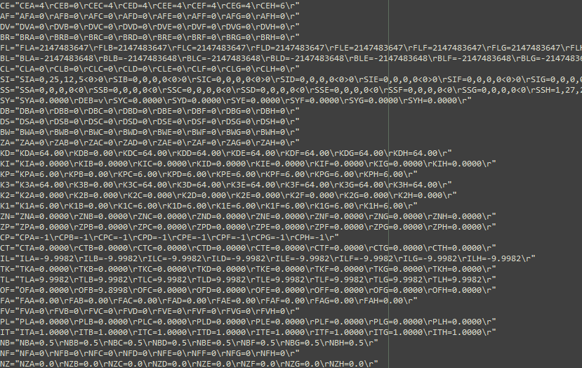
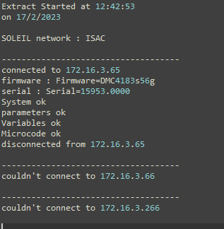

OSMOS DevGuide (WIP)
==============================

WELCOME HERE! This documentation intend to show you how to modify or improve OSMOS software. 

Description
-----------

OSMOS is a tool wich can communicate with the GALIL controllers of SOLEIL, 
extract the parameters/variables/microcode and write the into a file ``.bak``

This file is parsed according to GALIL format allowing to upload those settings
into the controller

A ``.log`` file is generated indicatig if everything went right during the download

The user can configure the software through 2 ``.csv`` files wich are described below

Software Architecture
---------------------

How OSMOS has been designed is represented by the software architecture below:

.. image:: ./software_architecture.PNG

The main objective of the software is to generate the ``.bak`` file as long as the ``.log`` file.

File format explanation
-----------------------

Backup File
^^^^^^^^^^^^
The Backup file is designed to save the common used GALIL parameters, 
as long as the microcode and/ or the variables/microcode.
This file has a **important specific format** understandable by the official GALIL software wich is used to download those
parameters back in a GALIL controller.

here is an example of a part of a backup file:

.. note:: It will be considered that you know the specifications of all the forms of this file.
	As much as you know the priciple functionning of GALIL motion systems.
	If you want an example, you can run GalilSuite software or OSMOS on a functionning controlbox

It is possible to add, remove or modify any parameters. It is possible to modify the way it written in the file as well
through the ``.csv`` file called : "OSM_LIST_CDE.csv".

Its default location is ``/OSMOS/Documentation/Reference/``

.. note:: Note tha a user can choose an other file than this one.

Log File
^^^^^^^^^^^^
Its only purpose is to indicate either something went wrong or not during the backup of parameters.

here is an example of a log file:

It exists 2 type of connections to a Powerbrick. You can connect through the "maintenance port".
This ethernet port exists on every PowerBrick and always has the same adress.

The other way allows you to enter an IP adress manually.

.. attention:: Be careful on wich you are able to connect or not.
	The software doesn't check what device is on the network. He is pretty simple.

=========================== ================================
IP Adress Type              Description                     
=========================== ================================
Default IP Adress           Maintenance Adress 172.168.0.200
Custom IP adress            any Standard PBR adress
=========================== ================================

How To Download
---------------

The Download feature allows you to extract setups (in folders form or in files form) of a Power Birck. 
You'll have to select what setup you want to download. It goes from "usrflash" for the most recent parameters
to "usrflash.5" for the oldest.

.. note:: Choosing a path to download is not implemented yet. The files downloaded are put where the script is run.

You can then, press on the green button *"Download"*.

How To Upload
---------------

.. The second feature is the upload. If you need to send data to a Power Brick, it's the convenient feature.

.. Secondly, move on the blue button  "Upload" just below the Download button. Select, the remote directory where you'll 
.. send the data (folder or files).
.. Thirdly, you must enter the path (absolute path) to the folder you want to send.

.. Finally, press on the button "Upload" and look at log on your request in the display below.  

.. note::There is always a message in a pop up that shows you what is required to perform each task in PBR_OSMOS GUI.

.. caution:: Because of a bug, the dynamic update of the GUI does'nt work. So you need to press on buttons
	to get the entry fields (ip address Entry) enabled.
